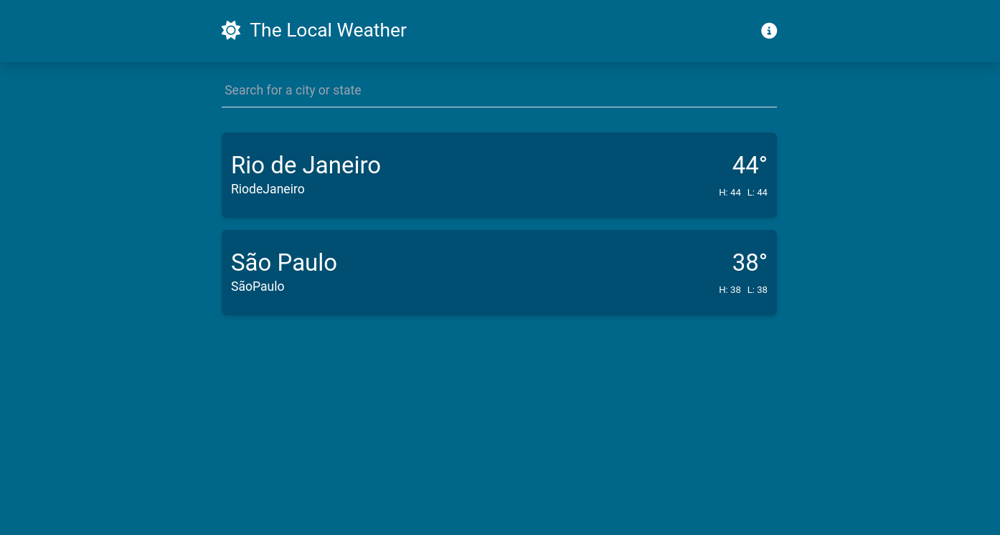

<h1 align="center"> Weather App </h1>
<p align="center">
    A weather application with the purpose of enhancing my VueJS skills 
    through this <a href="https://www.youtube.com/watch?v=gUsBaB5ViAo&list=PL4cUxeGkcC9hfoy8vFQ5tbXO3vY0xhhUZ" target="_blank">youtube</a> playlist.
</p>



## 🛠 Installation & Set Up

1. Clone the repository

   ```sh
   git clone https://github.com/PaulosSouza/vue-weather-website.git weather-app
   ```

2. Install dependencies

   ```sh
   npm i
   ```

3. Create an account and get API keys from [Mapbox](https://www.mapbox.com/) and [OpenWeather](https://openweathermap.org/) APIs.

4. Duplicate the file .env.example and replace those variables with your own api keys.

5. Start the development server.

   ```sh
   npm run dev
   ```

## 🚀 Building and Running for Production

1. Generate a production build to see how it works

   ```sh
   npm run build-only
   ```

## 🧑‍💻 Tecnologies Reference

- [Vuejs](https://vuejs.org/)
- [Vite](https://vitejs.dev/)
- [Typescript](https://www.typescriptlang.org/)
- [Tailwind](https://tailwindcss.com/)
- [OpenWeather](https://openweathermap.org/)
- [Mapbox](https://www.mapbox.com/)

#### Linters & Formatters

- [Eslint](https://eslint.org/)
- [Vue Eslint](https://eslint.vuejs.org/)
- [Airbnb Vue Eslint](https://github.com/vuejs/eslint-config-airbnb/tree/main/packages/eslint-config-airbnb-with-typescript#readme/)
- [Prettier](https://prettier.io/)

## 🚧 Improvements

- [ ] Use of useDebounceFn from [VueUse](https://vueuse.org/) instead of setTimeout
- [ ] Use of useFetch in one page instead of Suspense
- [ ] Add internationalization
